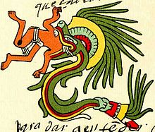

# Quetzalcoatl Web Server

* Final Project for Advanced Programming Course at ITESM - Fall '19 

 

  

  <h3 align="center"><i>n</i>-body simulation</h3>

  

    A lightweight alternative to the Apache server,built in C on top of Moongose library..
     
    <a href="https://github.com/salochara/FinalProject-AdvandedProgramming/issues">Report Bug or Request Feature</a>
  

We call it Quetzalcoatl, the feathered serpent, the god of wind and rain in the Aztec mythology.

## Built With

* [Mongoose](https://github.com/cesanta/mongoose/) - The web library used

## Authors
           			           	
* **Salomón Charabati Michan** - *A01022425* - [Salochara](http://github.com/salochara)
* **Roberto Alejandro Gutiérrez Guillén** - *A01019608* - [the-guti](https://github.com/the-guti)
* **Alberto Ramos** - *A01374020* - [Betorams](https://github.com/betorams)

## Acknowledgments

* Thanks to Gilberto Echeverria for the mentoring
